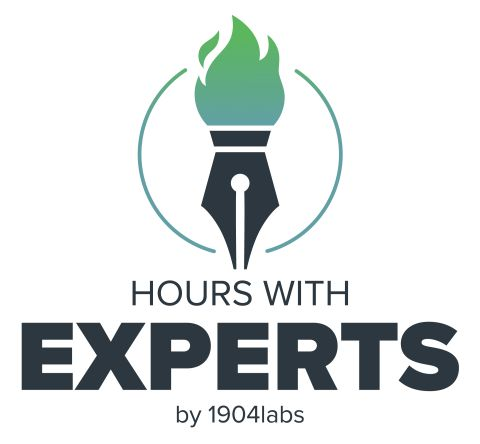
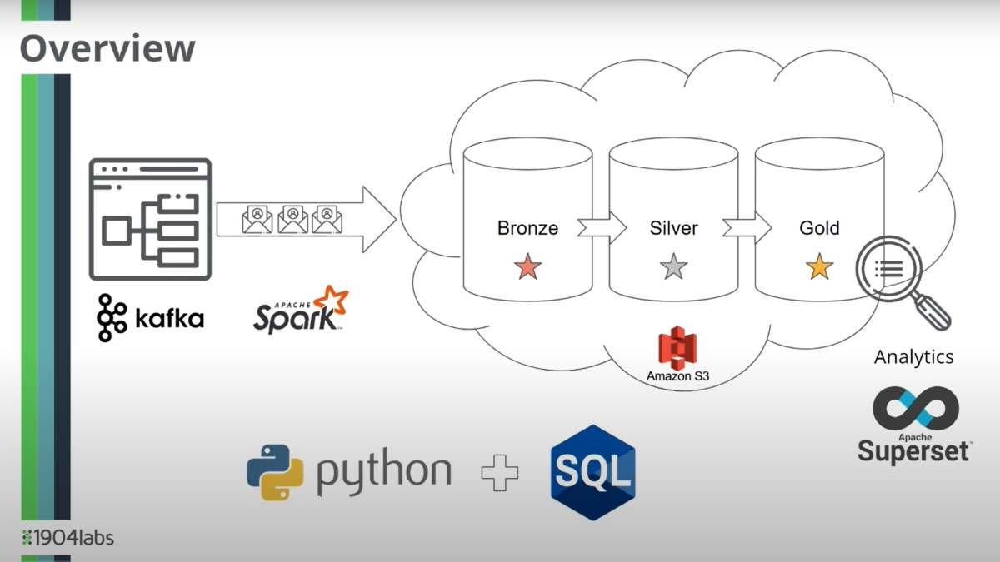

# Welcome to the Hours With Experts Labs Repo
This repository will be the central location for the hands-on programming component of the course.

## Course Work Overview

The goal of the course is to build an end-to-end data pipeline processing Amazon reviews.

The data pipeline you construct will look like below:

# Repo Overview

- [Week 1 - Environment Setup](week1_welcome/README.md) - Configure your environment to begin the programming course work
- [Week 2 - Spark SQL](week2_sql/README.md) - write a Python Spark application to analyze local Amazon review data
- [Week 3 - Write to Amazon S3](week3_python/README.md) - the program will now connect to Amazon S3 and write data to the storage
- [Week 4 - Kafka + Bronze layer](week4_kafka_bronze/README.md) - read from Kafka instead of the local file, and use Spark structured streaming to be output to Amazon S3 creating the Bronze layer
- [Week 5 - Silver layer](week5_silver/README.md) - transform and enrich data from the Bronze layer, creating the Silver layer
- [Week 6 - Gold layer](week6_gold/README.md) - define a schema for the silver layer, streams the data from the silver layer, transforms the data, and establishes the gold layer
- TODO: Week 7 BI

# Important Course Resources
- [Course resources on the Thinkific platform](https://hours-school-d024.thinkific.com/courses/hours-with-experts-cloud)

# Continued Learning
Want to continue your learning in Data Engineering?  Great -- check out these links:

* [STL Big Data - Innovation, Data Engineering, Analytics Group](https://www.meetup.com/st-louis-big-data-idea/)
A meetup for users of Big Data services and tools in the Saint Louis Area.  We are interested in Innovation (new tools, techniques, and services), Data Engineering (architecture and design of data movement systems), and Analytics (converting information into meaning).
(with Kit Menke and Matt Harris)

* [Data Engineering Podcast](https://www.dataengineeringpodcast.com/)
This show goes behind the scenes for the tools, techniques, and difficulties associated with the discipline of data engineering. Databases, workflows, automation, and data manipulation are just some of the topics that you will find here.

## Some Previous "STL Big Data - I.D.E.A" Meetups

[Apache Iceberg Presentation - August 2023](https://drive.google.com/file/d/1cM9SD8euuQCPoGUQukQpIGp7y6hgXknN/view?usp=share_link)

[LakeFS Presentation - June 2023](https://drive.google.com/file/d/1OHmEgfGuStoF7ZHhiMVpyVEkML1Hf37v/view?usp=share_link)
